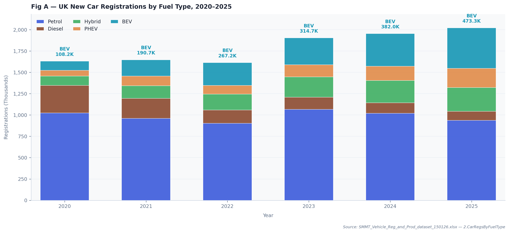
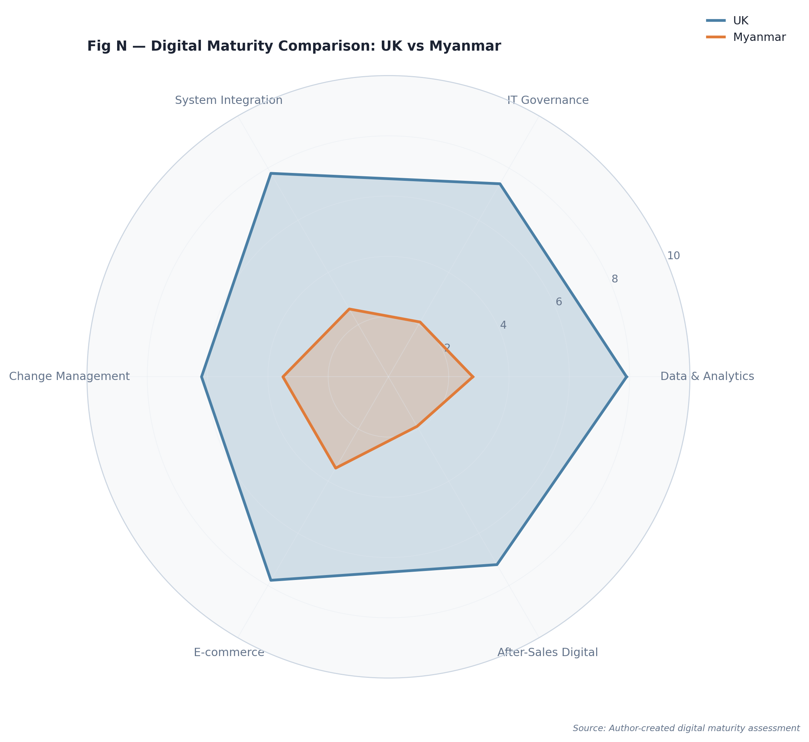
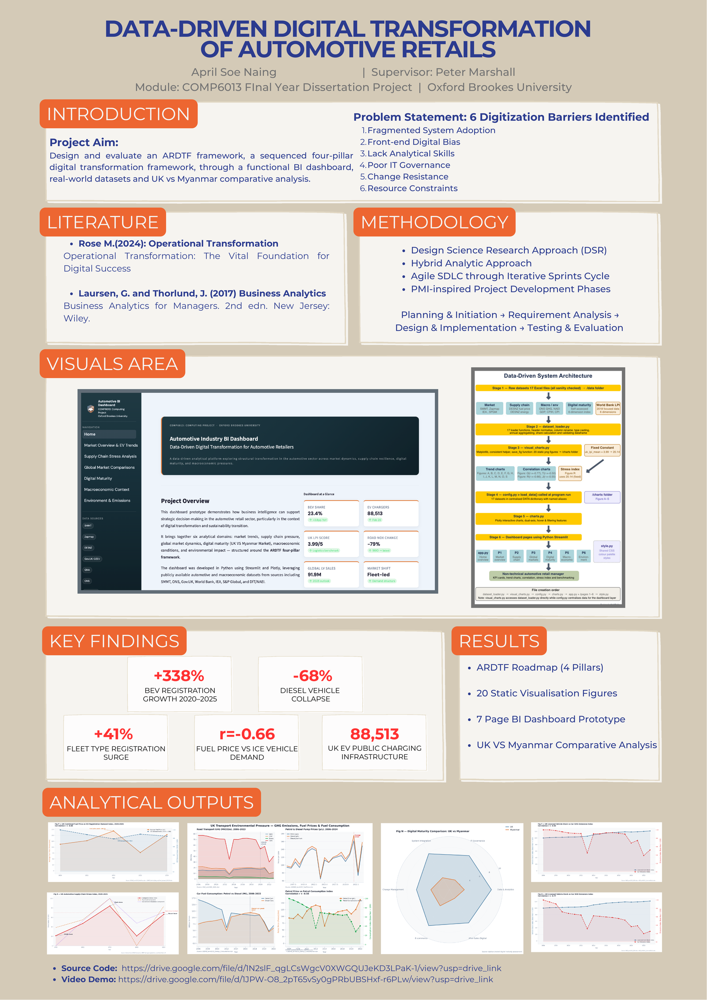

# ARDTF — Automotive Retail Digital Transformation Framework

> **Status: Complete.** BSc Computing final-year project (Oxford Brookes University).

## 1. Project overview

The automotive retail industry is going through its most significant structural transition in modern history — vehicle electrification, macroeconomic volatility, supply-chain fragility and rising consumer expectations for digital convenience, all at once. Despite this, many retailers (particularly SMEs) still run on fragmented systems, manual data-handling and limited analytical capability.

This project designs and evaluates the **Automotive Retail Digital Transformation Framework (ARDTF)** — a four-pillar model (operational foundation → analytics & business intelligence → IT governance → change management) that sequences digital transformation for automotive retailers, built on the premise that operational transformation must precede digital enhancement (Rose, 2024).

The framework is delivered as a functional **BI dashboard prototype**, built in Python (Pandas, Plotly, Streamlit), drawing on **14 secondary datasets** from credible sources — SMMT, ONS, World Bank, IEA, DESNZ, DfT, NAEI, Zapmap and S&P Global — producing **20 analytical chart figures** (Fig A–T) across **six analytical domains**: market trends, supply-chain pressure, global market dynamics, digital maturity (UK vs Myanmar), macroeconomic conditions, and environmental transition.

## 2. Key findings

- **BEV registrations grew 338%** between 2020 and 2025, while **diesel registrations collapsed by 68%** over the same period — a structural reconfiguration, not a marginal shift.
- **UK EV charging infrastructure grew 205%** across the same window.
- Fleet/corporate demand is increasingly driving the market while private demand has stagnated, adding new operational complexity for retailers.
- Macroeconomic shocks (the COVID-19 contraction, the 2022 inflation and energy crisis) created "burning platform" urgency that accelerated digital adoption among UK retailers.
- The **UK vs Myanmar digital maturity comparison** quantified the gap between developed and emerging-market digital transformation pathways: a World Bank Logistics Performance Index gap (UK 3.70 vs Myanmar 2.30), and a digital maturity radar showing IT governance as the largest gap (UK 7.4 vs Myanmar 2.1, a 5.3-point difference) — but **change management as the smallest gap** (UK 6.2 vs Myanmar 3.5, 2.7 points), suggesting Myanmar retailers already have organisational readiness that targeted intervention could mobilise at low cost.





## 3. Project poster



## 4. Dashboard structure

Built as a multi-page Streamlit app, with each page covering one analytical domain:

| Page | Domain |
|---|---|
| `app.py` (Home) | Executive summary — KPI headline cards, top-line trends |
| `pages/1_Market_Overview.py` | UK vehicle registrations by fuel type and sale type |
| `pages/2_Supply_Chain.py` | Vehicle production, fuel prices vs demand, supply-chain stress index |
| `pages/3_Global_Markets.py` | Global light-vehicle sales, World Bank Logistics Performance Index |
| `pages/4_Digital_Maturity.py` | UK vs Myanmar digital maturity comparison (the framework's original contribution) |
| `pages/5_Macroeconomic.py` | GDP growth, CPIH inflation, insurance CPI |
| `pages/6_Environment.py` | GHG/NOx emissions, EV charging infrastructure, vehicle stock |

All interactive charts are rendered live from the datasets in `data/` via `config.py` → `scripts/dataset_loader.py` → `charts.py` (Plotly). The static chart exports in `charts/` (Figures A–T, generated by `scripts/visual_charts.py` using Matplotlib) are the versions used in the written dissertation.

## Tech stack

- **Python** — `streamlit`, `plotly`, `pandas`
- **Matplotlib** — for the static Figure A–T exports (`scripts/visual_charts.py`)

## Project structure

```
ardtf-automotive-digital-transformation/
├── app.py                    # Home page — run this with `streamlit run app.py`
├── config.py                 # Loads all datasets, defines the shared visual style config
├── style.py                  # Custom CSS applied to the dashboard
├── charts.py                 # Interactive Plotly chart layer, used by all pages
├── pages/                    # One file per dashboard page (see table above)
├── scripts/
│   ├── dataset_loader.py     # Cleans and loads all 14 source datasets
│   └── visual_charts.py      # Generates the static Figure A-T exports (Matplotlib)
├── data/                     # 14 source datasets (SMMT, ONS, World Bank, IEA, DESNZ, etc.)
├── charts/                   # Final static chart exports (Figures A-T) referenced in the dissertation
├── images/
│   ├── icon.png               # Dashboard page icon
│   └── project-poster.png     # Final project poster (student ID redacted)
└── requirements.txt
```

## Setup

```bash
pip3 install -r requirements.txt
streamlit run app.py
```

**Before running**, update the hardcoded data path in `scripts/dataset_loader.py` (line 16) — it currently points to the original development machine:

```python
DATA_DIR = Path("/Users/april/Documents/Project/data")
```

Change it to point at this repo's `data/` folder, e.g.:

```python
DATA_DIR = Path(__file__).resolve().parent.parent / "data"
```

## Notes

This was an academic BSc final-year project. The dashboard code, charts and datasets here are the software artefact submitted alongside the written dissertation — the written report, proposal, progress report, presentations and supporting research literature are not included in this repo.

## Author

April Soe Naing — [aprilsoenaing.786@gmail.com](mailto:aprilsoenaing.786@gmail.com)
